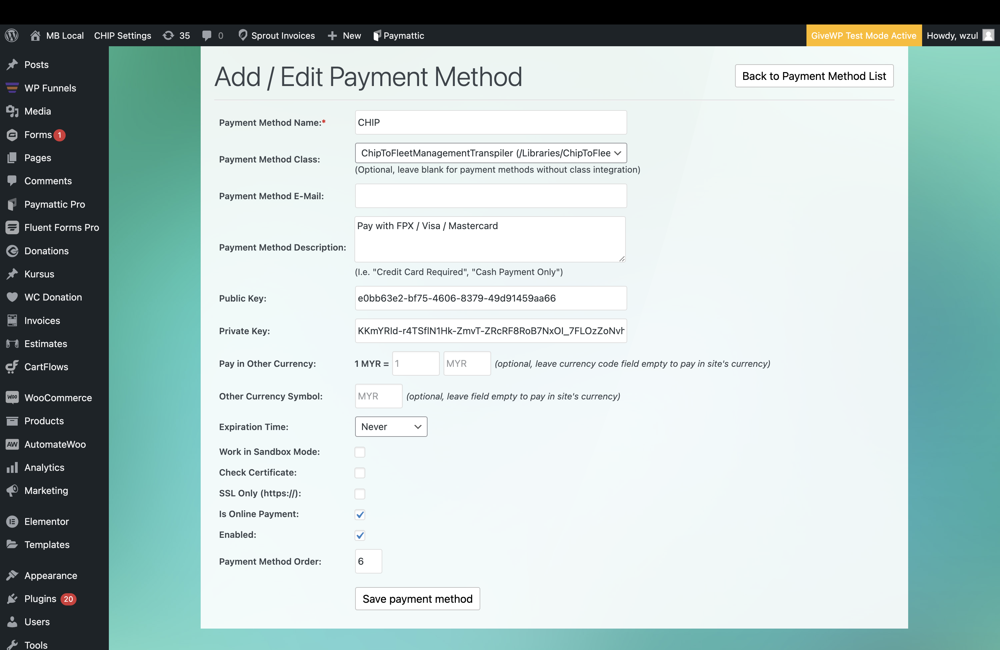
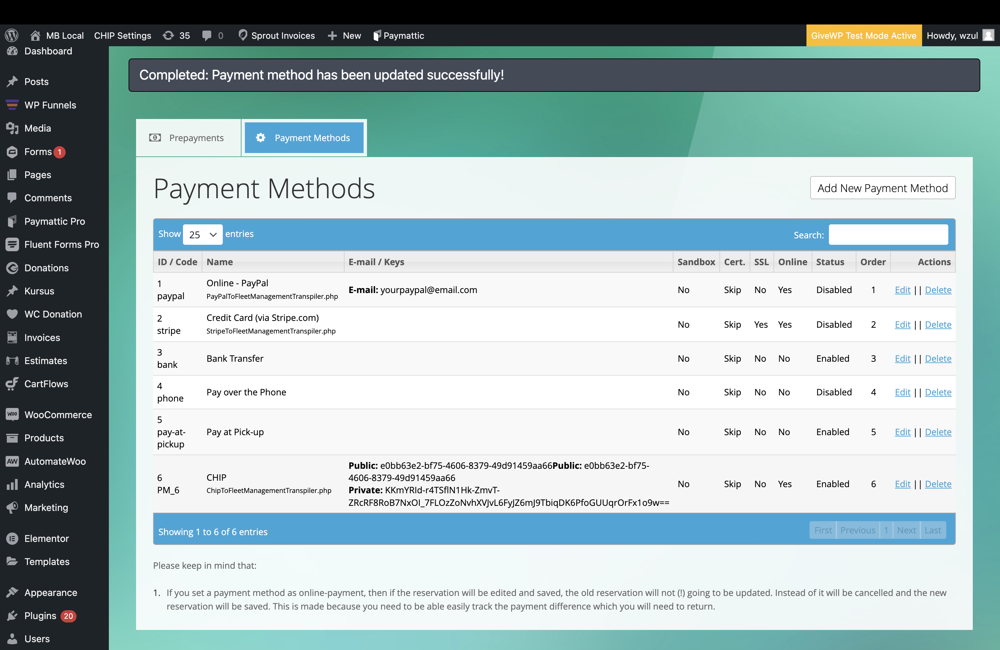
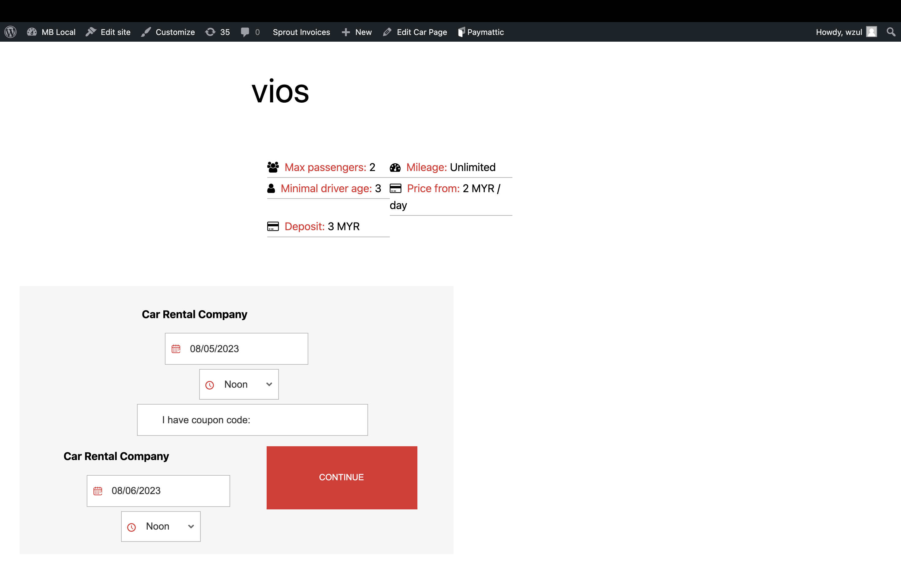
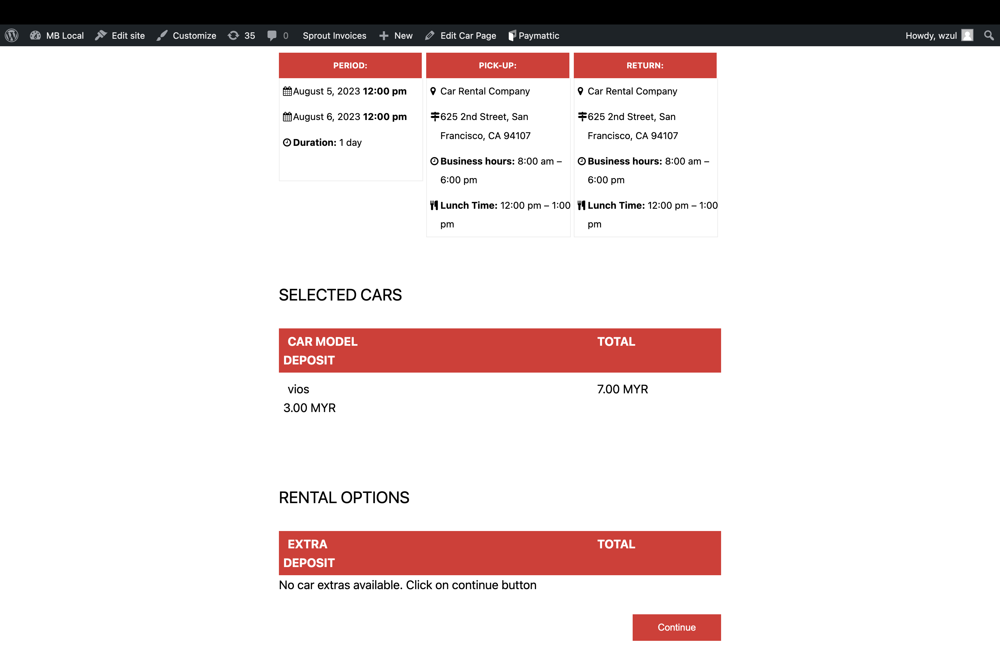
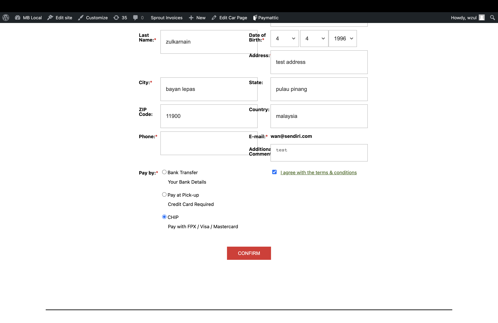
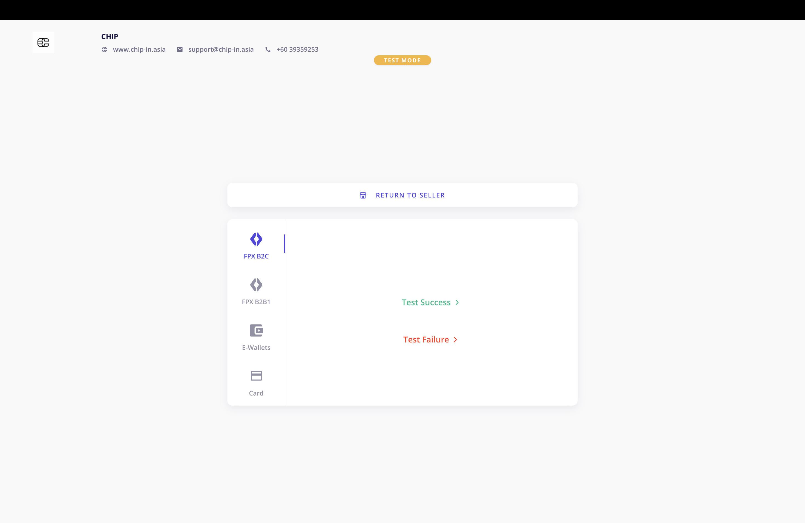
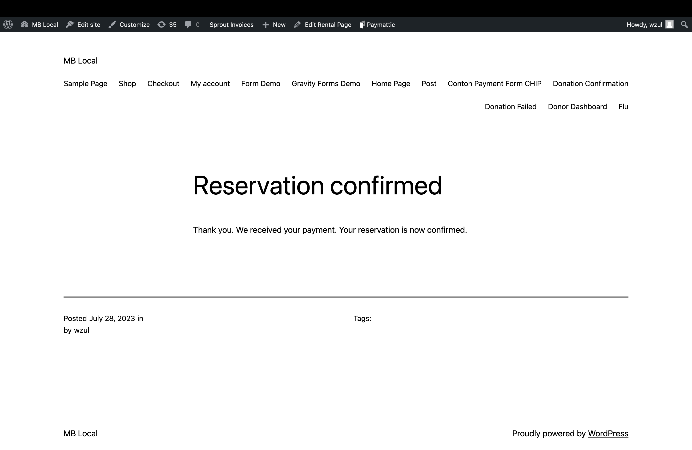
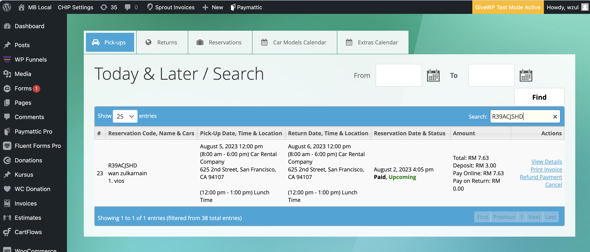
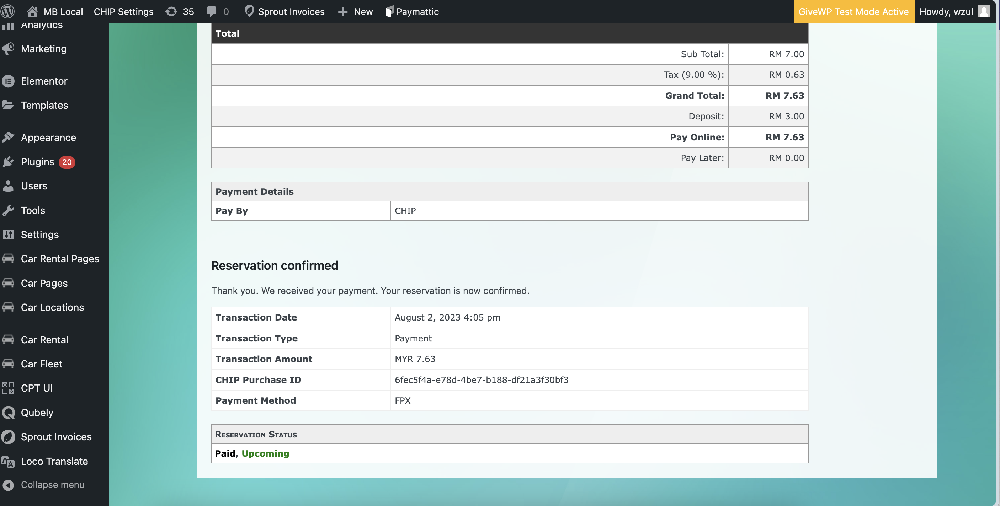

# CHIP for Car Rental System

This code adds CHIP payment method option to [Codecanyon - Car Rental System](https://codecanyon.net/item/car-rental-system-native-wordpress-plugin/11758680).

## Installation

This is not a plugin since the [Car Rental System](https://codecanyon.net/item/car-rental-system-native-wordpress-plugin/11758680) did not provide hooks for extending it's functionality with plugin. Hence, the existing plugin needs to be modified as follows:

1. [Download plugin zip file.](https://github.com/CHIPAsia/chip-for-car-rental-system/archive/refs/heads/main.zip)
1. The file must be extracted as per file structure below:

### File Structure

```text

 /wp-content/plugins/FleetManagement/
  |- Libraries/ChipToFleetManagementTranspiler.php
  |- Models/Chip/ChipPaymentsTable.php

```

## Configuration

- Set Payment Method Name, Payment Method Class, Payment Method Description, Brand ID as Public Key, Secret Key as Private Key, Is Online Payment tick, Enabled tick.



- You will see the payment method list after setting the payment method.



## Demo

- Customer choose car to rent



- Customer confirm the car



- Customer choose payment method



- Customer make payment



- Reservation completed



- Reservation reflected on admin side



- Reservation completed



## Other

Facebook: [Merchants & DEV Community](https://www.facebook.com/groups/3210496372558088)
